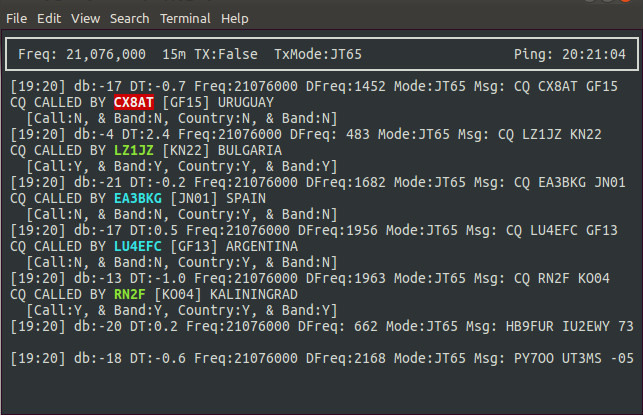

# py_wsjtx

Python application to decode the UDP messages sent by WSJT-X (http://physics.princeton.edu/pulsar/k1jt/wsjtx.html) - An amateur radio application.

WSJT-X sends status messages to a listening socket, this Python application decodes those messages and displays them in a terminal session.
* Can be configured to be a scrolling log or an ncurses display.
* Colour coding is used to show stations worked and countries worked, on current band.
* Can also be configured to output the decoded messages to a MQTT server in JSON format.

Screenshot showing colours for indication of worked stations/countries:

# Requirements:
pyhamtools (https://github.com/dh1tw/pyhamtools) and (obviously) it's requirements

# TODO:
* Pull configuration options out into a config file.
* Add code to display in QT gui.
